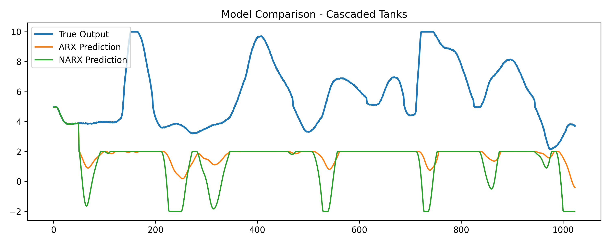

# Cascaded Tanks Benchmark – GRU-Based System Identification

This project presents a small work sample for nonlinear system identification using the **Cascaded Tanks benchmark**.

## 📌 Objective

The goal is to model the system dynamics and compare:

* A **GRU-based sequence model**
* A **Deep GRU model (stacked layers)**

Both models are trained on the provided dataset and evaluated in **simulation mode**, following the benchmark guidelines.

---

## ⚙️ Methodology

### 1. Data

* Dataset: Cascaded Tanks benchmark
* Train/test split provided by the benchmark
* Evaluation uses only the allowed initialization window

### 2. Models

#### 🔹 GRU (Gated Recurrent Unit)

* Sequence-based model using past inputs and outputs
* Captures temporal dependencies in the system
* Serves as the baseline sequence model

#### 🔹 Deep GRU

* Stacked GRU layers for higher model capacity
* Better suited for complex nonlinear dynamics
* Expected to improve performance over standard GRU

---

## 📊 Results

| Model    | RMSE  |
|----------|------|
| GRU      | ~3.19 |
| Deep GRU | ~2.12 |

> The Deep GRU model performs better due to increased representational capacity and ability to capture more complex temporal patterns.

---

## 📈 Model Comparison

The following plot shows the true system output along with predictions from both models:



---

## 🧠 Observations

* GRU models are effective for modeling time-series dynamics in nonlinear systems.
* The Deep GRU provides improved performance compared to the single-layer GRU.
* Autoregressive simulation introduces accumulated error, making training stability important.

---

## 🚀 How to Run

1. Install dependencies:

   ```bash
   pip install -r requirements.txt

2. Run the main script:,
   python main.py

3. Output
   RMSE values printed in console
   Plot saved in results/ folder


This project demonstrates:

Implementation of sequence-based models for system identification
Proper evaluation using simulation-based prediction
Comparison using both quantitative (RMSE) and qualitative (plots) analysis
